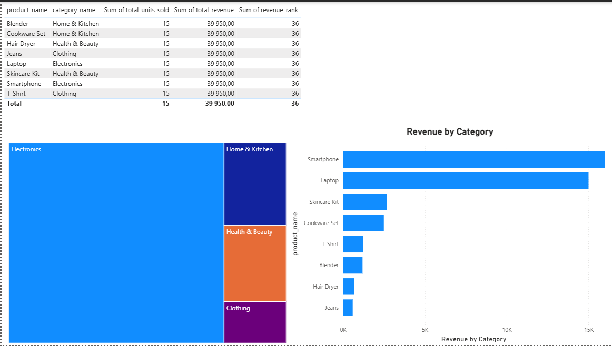
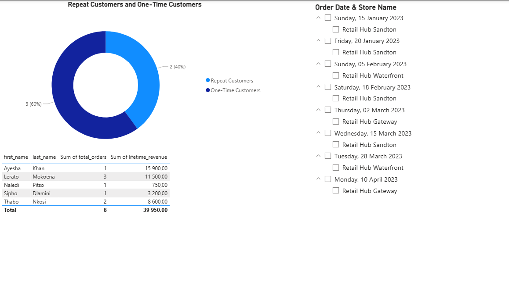
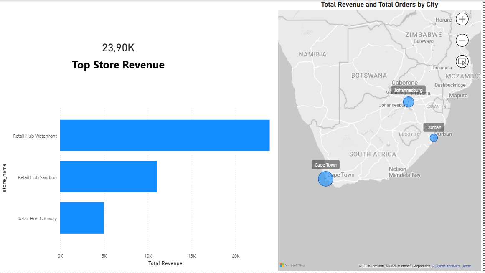

# Retail Analytics Dashboard  
End-to-End SQL Server & Power BI Project

---

## Executive Summary
This project presents a comprehensive retail analytics solution built using SQL Server and Power BI.  
It replicates a real-world business intelligence workflow, transforming raw transactional data into actionable insights for decision-makers.

The analysis focuses on sales performance, customer behavior, product trends, and store-level performance.  
All data was designed, created, and queried from scratch with an emphasis on analytical modeling and business relevance.

---

## Business Objectives
This project aims to answer key business questions such as:

- How is revenue trending over time?
- Which products and categories generate the most revenue?
- Who are the most valuable customers?
- How do stores perform relative to one another?
- What proportion of customers are repeat buyers?

---

## Data Model Overview

### Tables
- customers  
- orders  
- order_items  
- products  
- categories  
- stores  

### Relationships
- customers → orders (one-to-many)
- orders → order_items (one-to-many)
- products → categories (many-to-one)
- orders → stores (many-to-one)

The model follows a normalized relational structure commonly used in retail systems.

---

## Tools & Technologies
- SQL Server (T-SQL)
- Power BI
- DAX
- Git & GitHub
- VS Code

---

## Analytical Workflow

### 1. Data Creation & Preparation (SQL Server)
- Designed database schema from scratch
- Inserted mock retail data
- Implemented primary and foreign keys to ensure data integrity

### 2. Analytical Views (SQL)
Business logic was implemented using SQL views to simplify analysis and improve performance.

Key views include:
- Monthly Sales Summary
- Customer Lifetime Value
- Product Performance
- Store Performance
- Customer Order Frequency

### 3. Power BI Modeling & DAX
A dedicated Measures table was created to centralize calculations.

Key measures:
- Total Revenue
- Total Orders
- Average Order Value (AOV)
- Monthly Revenue
- Month-over-Month Revenue Growth %
- Customer Lifetime Value (CLV)
- Top Store Revenue
- Repeat vs One-Time Customers

---

## Dashboard Pages

### Sales Trends

- Monthly revenue trends
- Time-based performance analysis

---

### Product & Category Performance

- Revenue by product and category
- Identification of top-performing items

---

### Customer Insights

- Customer lifetime value analysis
- Repeat vs one-time customer segmentation

---

### Store Performance

- Revenue by store
- Geographic performance comparison
- Top-performing store KPI

---

## Key Insights
- A small group of customers contributes a large share of total revenue
- Repeat customers generate significantly higher lifetime value
- Certain product categories consistently outperform others
- Store performance varies by location, indicating optimization opportunities

---

## 👤 Author
**Boiketlo Thabang Lorekang**

